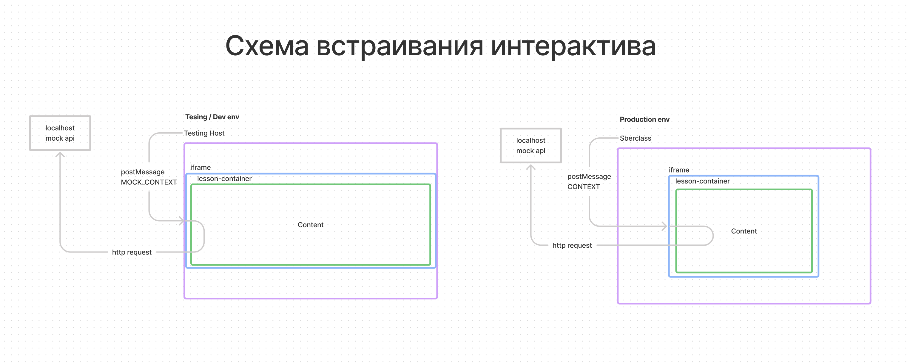

# Образовательные интерактивы

**NDA**

Репа с исходным кодом всех геймифицированных образовательных модулей.
[Методология](https://www.notion.so/SberBio-f743188b14b443c98d842d5c92433313),
   [Разработка](https://www.notion.so/maging/BIO-1653180fd0c04b3aa4809a8a5ca16b5b)

## Запуск проекта

установка зависимостей
```shell
yarn 
```

Поднимает dev стенд на http://localhost:3000. На стенде можно открывать интерактивы в режиме встраивания через iframe.
```shell
yarn start
```

Запуск storybook

```shell
yarn storybook
```

## Production cборка

```shell
yarn build:packages
```

## Структура
```
scripts/ - скрипты для сборки
codegen/ - сгенерированные ассеты, тексты и тд
src/
   api/ - реализация запросов api
   app/ - папка с входными точками дев платформы
      pages/ - страничные компоненты дев платформы
      routes.ts - роуты дев стенда
      app.ts - корень дев платформы
      react-root.ts - реакт корень
   components/ - переиспользуемые компоненты и компоненты dev стенда
      chat/
         app.tsx - сам компонент
         css.tsx - стили, если применимо
         
   context-providers/ - провайдеры React Context-а
    
   lessons/ - корневая папка неконструкторных интерактивов
      some-lesson/
         components/ - компоненты интерактива
         context/ - контекст интерактива, конфиги и типы
            lesson-context.tsx
            types.tsx - типы
         scenarios/
            simulator/
               app.tsx - входная точка с роутами
               context.tsx - контекст сценария
         app.tsx - входная точка с роутами
         routes.tsx - роуты интерактива
         meta.json - мета конфиг
   public/ - шаблоны для сборщика
   utils/ - хелперы на любой вкус
   custom.d.ts - декларирование доп типов, если ts ругается
   app.tsx - входная точка дев стенда
```

## Стек

* Typescript

* Фронтовый фреймворк - [React](https://ru.reactjs.org/tutorial/tutorial.html)

* Управление стейтом - React Context  

* Роутер - [ReactRouter](https://reactrouter.com/web/guides/quick-start) Важно! Внутри iframe-а можно юзать только MemoryRouter, 
BrowserRouter работает криво из-за завязки на урл.
  
* Стили - [emotion](https://emotion.sh/docs/introduction)

* Сборка - [Webpack](https://webpack.js.org)

* Http клиент - fetch))0

* В проекте есть [Storybook](https://storybook.js.org) для просмотра библиотеки компонентов

## Архитектура



Ключевой элемент проекта - Интерактив. В интерактиве может быть несколько сценариев с разной механикой - Симуляторы, тренажеры и тд.

В проде каждый сценарий интерактива представляет собой отдельное реакт приложение и  хостится отдельной папкой со статикой, с заданными заранее настройками сценария. 
Для удобства разработки в dev режиме все интерактивы со всеми сценариями хостятся на одном "Дев стенде", с возможностью навигации между ними.


**IframeLessonViewer**

По сути корневой компонент дев стенда

Нужен для эмулирования встравивания lesson-а через iframe, просто встраивает iframe, ссылающийся на url /<lesson-name> и
бросает заглушечный контекст через postMessage

**lesson-container**

Универсальный для всех интерактивов компонент-обертка, содержит в себе общие для всего проекта react-контексты,
такие как chat, theme и др.

В проде каждый Lesson хостится отдельной плоской папкой со статикой. В платформу-хост встраивается через iframe, 
при иницициализации получает от платформы объект с контекстом через postMessage. Подробно про контракты и апи платформы [тут](https://www.notion.so/maging/Wiki-9c944c543d0542beb2104801019344e3)

## Рецепты и паттерны

### Как разрабатывать новый неконструкторный Интерактив
1. Создать подпапку в `src/lessons`, с минимальным содержимым:
   * Файл app.tsx с дефолтным экпортом React компонента, обернутого в [HOC](https://ru.reactjs.org/docs/higher-order-components.html) - `createLesson(SomeLesson)`
   * Файл routes.tsx с роутами интерактива
   * meta.json - конфиг с описанием lesson-а внутри Сберкласса

2. Добавить новый lesson в `app/routes` для отображения на дев стенде.

После этих 2 шагов новый интерактив должен появиться в шапке дев стенда, а также включится в пакетную сборку для прода.

### Роутинг

"Как разделять сценарии интерактива, сделать переходы между разными экранами"

Используем MemoryRouter. Помимо корневого роутинга в /lessons/[some-interactive]/app.tsx можно добавить дочерний роутер конкретного сценария 
в /lessons/[some-interactive]/scenarions/simulator/app.tsx например.

Для удобной работы с роутами, определения на какой странице находимся, генерации ссылок, испольхуем 
функцию `createRoutes` из `utils/routes`. примеры использования можно найти в коде.

### Управление стейтом компонента

Для простого стейта используем стандартный `useState`, Но, если нужно управлять сложным составным стейтом, либо часто применять последовательные модификации,
используем `useImmerState` - внутри он используем библиотеку `immer`, синтаксис примерно такой

```javascript
const [state, produceState] = useImmerState({
   a: {
       subA: {
           items: []
       }
   }, 
   b: {
       c: 1,
   }
});

/*
 * Важно!
 * Внутри коллбека productState не должно быть side-effects,
 * иначе порядок изменения стейта становится неочевидным
 */
produceState((draft) => {
    draft.a.subA[1] = 'first-item';
    draft.b = {
        ...draft.b,
       g: 3,
    }
});
```
useImmerState также помогает оптимизировать цепочку изменений в макротасках:
```javascript
    
    /*
     * Плохо, тк реакт батчит изменения только внутри useEffect и 
     * обработчиках событий
     */
   function modifyState() {
        setStateA(1);
        setStateB(2);
        setStateC(3);
   }
   
   useEffect(() => {
       setTimeout(modifyState, 100); // тут будет 3 ререндера
   }, [])
    
    function modifyState() {
       productState(draft => {
           draft.a = 1;
           draft.b = 2;
           draft.c = 3;
       })
    }

    useEffect(() => {
       setTimeout(modifyState, 100); // тут будет 1 ререндер
    }, [])
```

### Сценарии

Используем хук `useStages`, он позволяет удобно описывать пошаговые алгоритмы, используя имеративный синтаксис

```javascript
enum Stages {
    one = 'one',
    two = 'two',
    three = three
}

const stager = useStages({
   async [Stages.one]() {
       chat.sendMessage(...)
       await sleep(1000)
      produceState(...)
   },
   async [Stages.two]() {
      produceState(...);
      
      return Stages.three
   },
   async [Stages.three]() {
      chat.sendMessage(...);
      await sleep(1000)
      produceState(...);
   }
}, Stages.one)

stager.runStage(Stages.two);

const onClick = () => {
    if(stager.is(Stages.one)) {
        ...
    }
}

```
Ограничения - в stag-ах нельзя создавать функции, чтобы зпписать их в стейт
```javascript
   async [Stages.one]() {
   produceState(draft => {
       // Плохо, тк начинаются пробелмы с замыканиями
       draft.button.onClick = () => {
           ...
       }
   })
},
```

### Отладка 
Если нужно что-то залогировать для долгосрочной отладки используем `utils/logger` используем logger.debug !!!
он будет работать только на дев стенде и логи не попадут в прод.

Если нужно сделать удобную навигацию, настройку параметров для дева, расширяем компонент Devtools, он также не попадет в прод.

### Соглашения по кодстайлу

Все что eslint считает ошибкой - нужно фиксить (у suspense-ов должны быть комменты). Остальные правила и рекомендации:

**Файлы**

| Правило     | Объяснение | Сила |
| ----------- | ----------- |  -----------   |
| имена файлов в kebab-case     |  бывают проблемы с регистрозависимостью гита и некоторыми fs   |  Всегда       |
| export const а не export default    |    Экономия на рефакторинге и единообразие при добавлении новых экспортов, уменьшение количества анонимных функций, сразу видно что экспортируется      |       Могут быть исключения         |
|    |         |                |


**React**

| Правило     | Объяснение | Сила |
| ----------- | ----------- |  -----------   |
| используем FC и хуки      |     codestyle   |  Могут быть исключения         |
| Базовые UI kit компоненты заносим в storybook   |  Чтобы не плодить велосипедов и быстрее находить нужные компоненты      |      Могут быть исключения          |
|    |         |                |

**Emotion**

| Правило     | Объяснение | Сила |
| ----------- | ----------- |  -----------   |
| либо css prop, либо StyledRoot компонент | codestyle | могут быть исключения |
| css prop только для корневого div-а или плоской структуры  | иначе верстка быстро становится не читаема   |  Могут быть исключения         |
| Не выносить коневой css prop в отдельный файл  | теряем прокидывание пропсов в стили, как вариант можно сделать StyledRoot и вынести его  |  Могут быть исключения |
| Корневой css prop лучше кучи styled компонентов |    codestyle     |  Могут быть исключения  |
|    |         |                |


## Процессы
Каждая задача - отдельная ветка в git. После разработки нужно сделать MR с описанием изменений,
скинуть ссылку в чат для призыва ревьюеров.

Важно - разработчик задачи ответственнен за ее влитие в мастер и доставку до прода.
Если падают проверки в гитлаюе, нужно чинить, если есть спорные комментарии - нужно выносить на общее обсуждение,
после внесения правок и аппрува - самостоятельно замерджить и проверить работоспособность стенда.